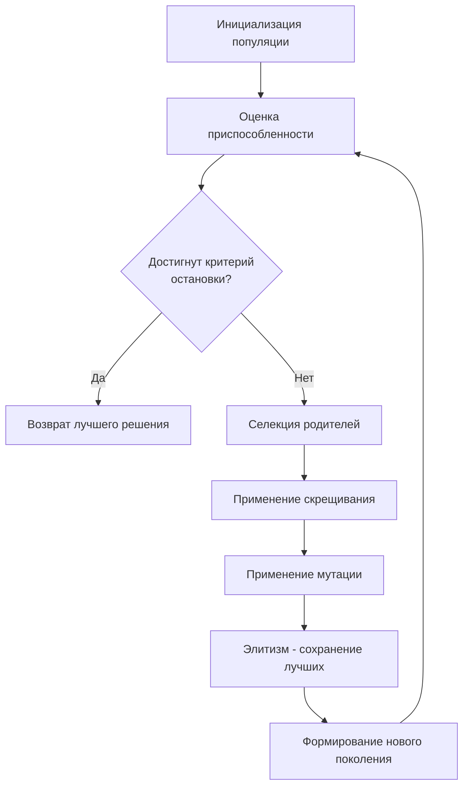
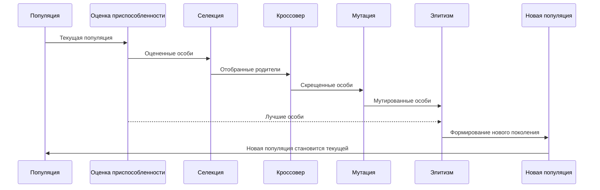
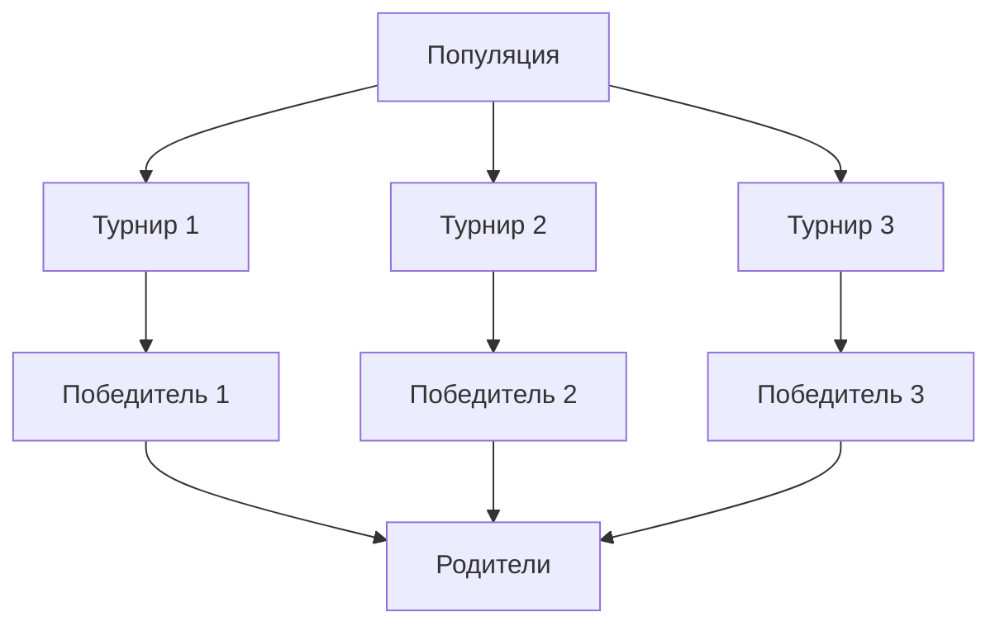
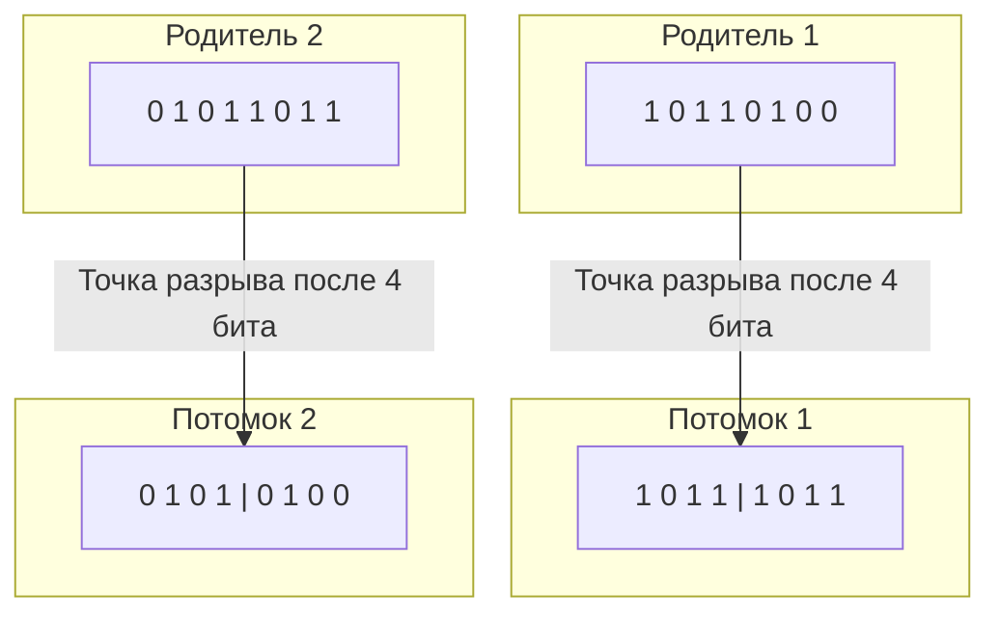
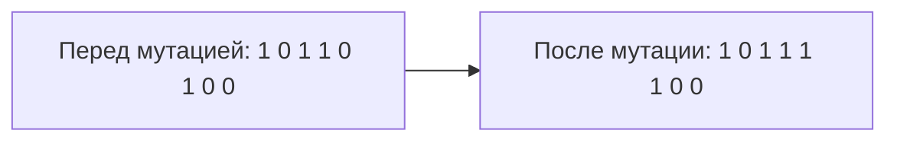
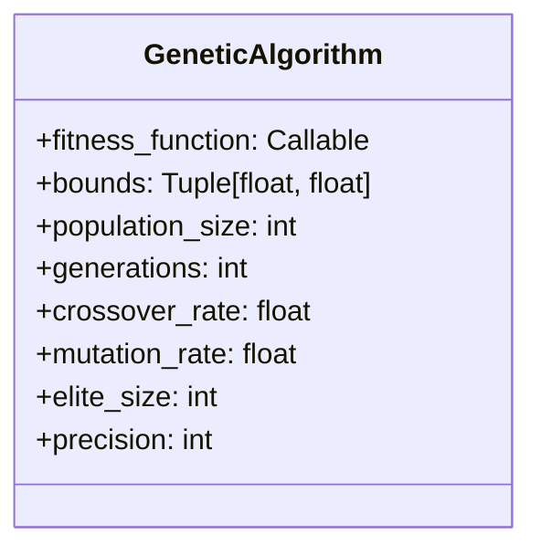

# Генетический алгоритм

Проект представляет собой реализацию генетического алгоритма для нахождения минимума функции одной переменной. Генетический алгоритм - это метод оптимизации, основанный на принципах естественного отбора и генетики.

## Содержание

- [Обзор](#обзор)
- [Принцип работы](#принцип-работы)
- [Структура проекта](#структура-проекта)
- [Детали реализации](#детали-реализации)
  - [Представление особей](#представление-особей)
  - [Инициализация популяции](#инициализация-популяции)
  - [Функция приспособленности](#функция-приспособленности)
  - [Селекция](#селекция)
  - [Кроссовер](#кроссовер)
  - [Мутация](#мутация)
  - [Элитизм](#элитизм)
- [Как запустить](#как-запустить)
- [Параметры алгоритма](#параметры-алгоритма)
- [Примеры](#примеры)

## Обзор

Данный проект реализует классический генетический алгоритм для поиска минимума функции `f(x) = cos(3x - 15) * x` в заданном диапазоне `[-9.6, 9.1]`. Генетический алгоритм – это эвристический метод оптимизации, вдохновленный процессом естественного отбора, который итеративно улучшает популяцию потенциальных решений путем применения биологически-инспирированных операторов таких как селекция, кроссовер и мутация.

## Принцип работы

Генетический алгоритм работает по следующему принципу:



Жизненный цикл поколения в генетическом алгоритме:



## Структура проекта

```
genetic_algorithm/
├── lib/
│   ├── __init__.py
│   └── genetic_algorithm.py  # Основная реализация генетического алгоритма
├── main.py                  # Точка входа и пример использования
├── poetry.lock              # Файл блокировки зависимостей Poetry
└── pyproject.toml           # Конфигурация проекта и зависимости
```

## Детали реализации

### Представление особей

Каждая особь представлена в виде бинарной строки фиксированной длины (по умолчанию 32 бита), которая кодирует значение `x` в пределах заданного диапазона.


### Инициализация популяции

Начальная популяция создается случайным образом, где каждая особь - это случайная бинарная строка.

```python
def _initialize_population(self) -> List[np.ndarray]:
    return [np.random.randint(0, 2, self.precision) for _ in range(self.population_size)]
```

### Функция приспособленности

Функция приспособленности определяет, насколько хорошо каждая особь решает поставленную задачу. В нашем случае, мы минимизируем функцию `f(x) = cos(3x - 15) * x`.

```python
def function(x: float) -> float:
    return np.cos(3 * x - 15) * x
```

### Селекция

Для селекции используется турнирный отбор, при котором случайно выбираются несколько особей (размер турнира = 3), и лучшая из них становится родителем.



```python
def _select_parents(self, population, fitness_scores):
    tournament_size = 3
    parents = []

    for _ in range(self.population_size):
        tournament_indices = np.random.choice(len(population), tournament_size, replace=False)
        tournament_fitnesses = [fitness_scores[i] for i in tournament_indices]
        winner_idx = tournament_indices[np.argmin(tournament_fitnesses)]
        parents.append(population[winner_idx])

    return parents
```

### Кроссовер

Операция кроссовера (скрещивания) происходит с вероятностью `crossover_rate`. При кроссовере выбирается случайная точка разрыва, и два родителя обмениваются генетическим материалом, создавая двух потомков.



```python
def _crossover(self, parent1, parent2):
    crossover_point = random.randint(0, self.precision - 1)
    child1 = np.concatenate([parent1[:crossover_point], parent2[crossover_point:]])
    child2 = np.concatenate([parent2[:crossover_point], parent1[crossover_point:]])
    return child1, child2
```

### Мутация

После кроссовера каждый бит потомка может мутировать с вероятностью `mutation_rate`. Мутация инвертирует значение бита (0 → 1 или 1 → 0).



```python
def _mutate(self, individual):
    for i in range(len(individual)):
        if random.random() < self.mutation_rate:
            individual[i] = 1 - individual[i]
    return individual
```

### Элитизм

Элитизм гарантирует, что лучшие особи из текущего поколения перейдут в следующее поколение без изменений. Это предотвращает потерю хороших решений в процессе эволюции.


```python
# Сохранение элиты
elite_indices = np.argsort(fitness_scores)[: self.elite_size]
for idx in elite_indices:
    new_population.append(population[idx])
```

## Как запустить

1. Установите зависимости с помощью Poetry:
   ```
   poetry install
   ```

2. Запустите основной скрипт:
   ```
   poetry run python main.py
   ```

## Параметры алгоритма

Основные настраиваемые параметры алгоритма:



- `fitness_function`: Функция, которую мы минимизируем
- `bounds`: Диапазон поиска [min, max]
- `population_size`: Размер популяции (по умолчанию 100)
- `generations`: Количество поколений (по умолчанию 100)
- `crossover_rate`: Вероятность скрещивания (по умолчанию 0.8)
- `mutation_rate`: Вероятность мутации (по умолчанию 0.1)
- `elite_size`: Количество элитных особей (по умолчанию 5)
- `precision`: Длина битовой строки, представляющей особь (по умолчанию 32)

## Примеры

В файле `main.py` содержится пример использования генетического алгоритма для минимизации функции `f(x) = cos(3x - 15) * x` в диапазоне `[-9.6, 9.1]`.

Вот график целевой функции:

```mermaid
xychart-beta
    title "f(x) = cos(3x - 15) * x"
    x-axis [-10, -8, -6, -4, -2, 0, 2, 4, 6, 8, 10]
    y-axis [-10, -8, -6, -4, -2, 0, 2, 4, 6, 8, 10]
    line [(-9.6, -6.17), (-8, -1.37), (-6, 5.78), (-4, -3.16), (-2, 1.70), (0, 0), (2, -1.70), (4, 3.16), (6, -5.78), (8, 1.37), (9.1, 4.15)]
```

Результат работы алгоритма:
```
Best solution found: x = 5.785
Function value at best solution: f(x) = -5.999
```
